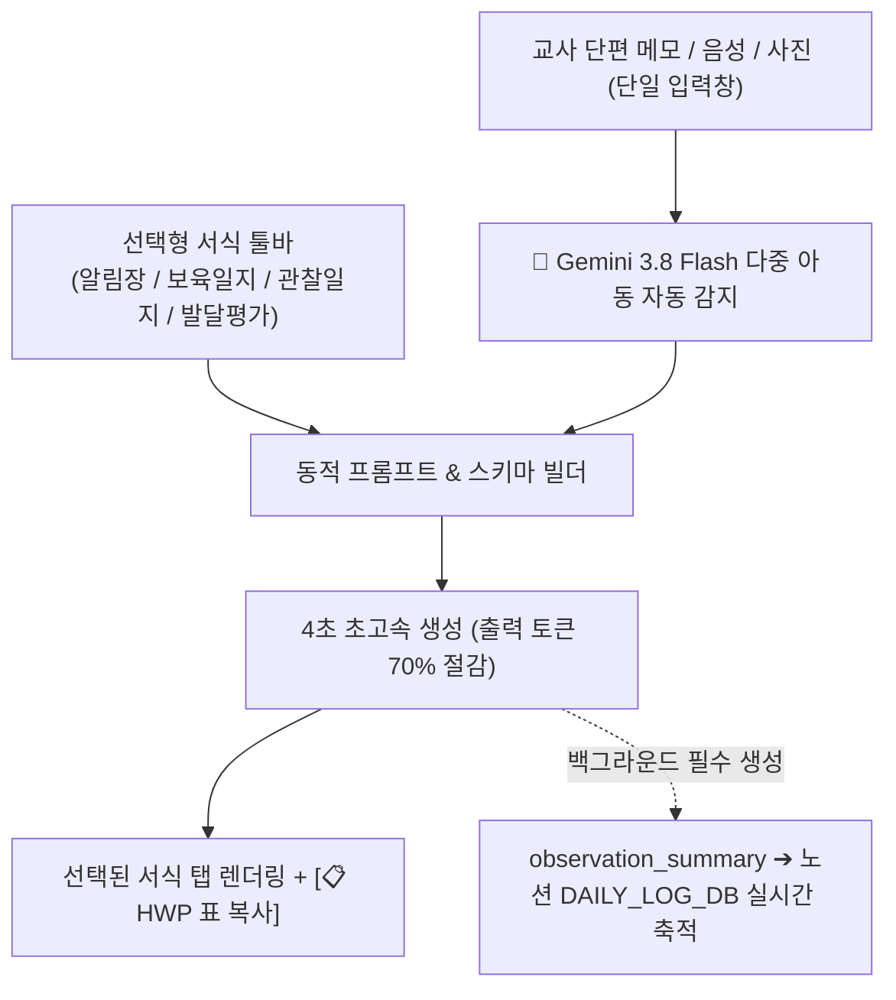
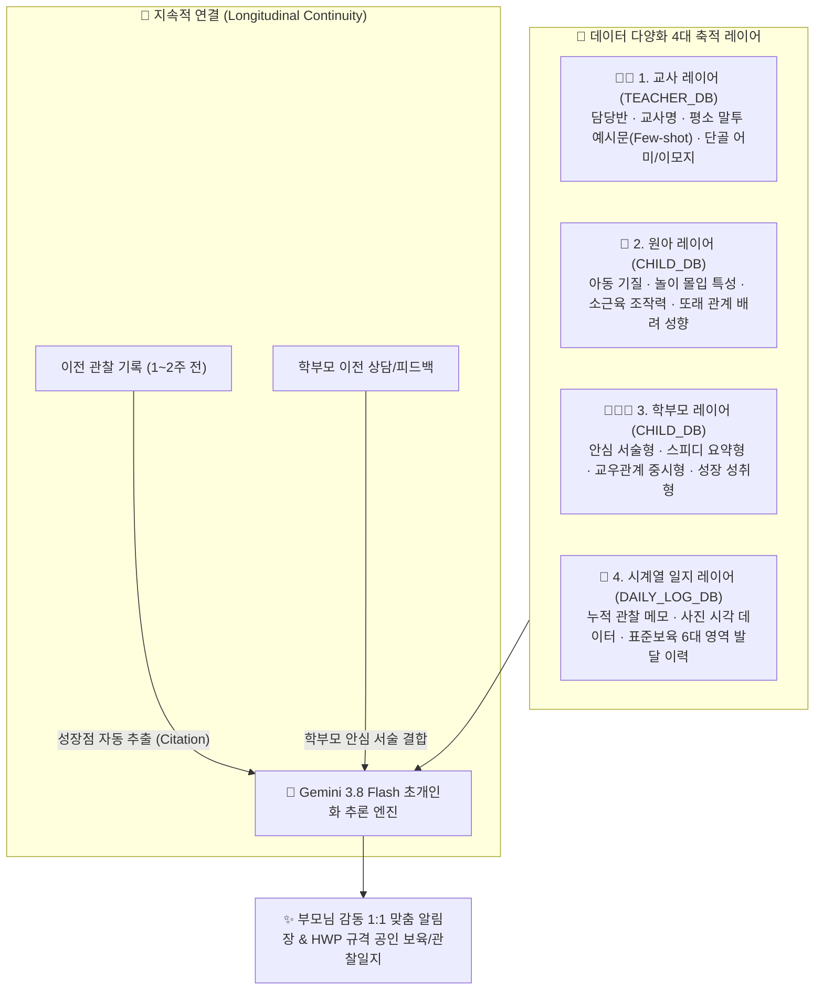

# 🧸 어린이집 교사 맞춤형 AI 보육 비서 (`daycare-helper`) 명세서 (SSOT)

> **문서 버전**: 3.3.0 (2026-09-20 최신 개정)  
> **상태**: 4대 서식 선택 툴바 & 토큰 70% 절감 & HWP 표 복사 & 노션 3대 DB 무결성 연동 완비  
> **대상**: 대한민국 어린이집/유치원 교사 (실무 현장 맞춤형)

---

## 1. 프로젝트 개요 및 핵심 철학

어린이집 교사의 가장 큰 격무 중 하나인 **"키즈노트 알림장 작성"**과 **"평가제 보육/관찰일지 작성"**을 1회의 거친 메모 또는 활동 사진(최대 6장) 입력만으로 완벽하게 해결합니다.

### 🌟 4대 핵심 원칙
1. **Zero Burden (입력 피로 0)**: 정돈되지 않은 거친 단편 메모나 음성 녹음(STT), 스마트폰 사진(최대 6장)만으로 즉시 공문서/알림장 완성본 도출.
2. **On-Demand Smart Formats (선택형 서식 스마트 생성)**: 매번 모든 일지를 강제 생성하지 않고, 오늘 필요한 서식(알림장, 보육일지, 관찰일지, 발달평가)만 칩으로 켜서 4초 만에 초고속 도출 (토큰 70% 절감).
3. **Continuous Data Integrity (노션 무결성 백그라운드 축적)**: 교사가 화면에서 관찰일지 칩을 꺼두더라도 AI가 1줄 관찰 요약을 항상 백그라운드 생성하여 노션 일지 DB에 누락 없는 시계열 성장 데이터베이스 구축.
4. **Zero Privacy Risk & Zero Accident**: 원아 실명은 Gemini 전송 전 `[아동A]`로 마스킹되고 수신 후 로컬 복원되며, 발송은 자동 전송이 아닌 **원터치 복사 및 네이티브 앱 공유**로 전송 사고를 100% 방지.

---

## 2. 단일 스트림라인 입력 & 4대 서식 선택형 스마트 툴바 (`selected_formats`)

과거의 복잡한 사전 모드 선택이나 원아 선택 강제를 완전히 폐지하고, **단일 메모창 + 스마트 서식 토글 툴바** 체계로 전면 통합했습니다.

### 1) 4대 서식 스마트 토글 툴바 사양
- **선택 칩 4종**:
  1. 📸 **키즈노트 알림장 (`kidsnote`)**: 기본 ON. 학부모 소통용 다정체 (250~400자 생생 서술).
  2. 📄 **놀이 보육일지 (`daily_log`)**: 기본 ON. 평가제 및 결재용 A4 공문서 규격 (한글 HWP 표 복사 지원).
  3. 🧸 **평가제 관찰일지 (`observation`)**: 기본 OFF (필요 시 ON). 월 1~2회 표준보육 객관체 (1차 ➔ 2차 발전 변화 연계).
  4. 📊 **발달 종합평가 (`development`)**: 기본 OFF (필요 시 ON). 표준보육 6대 영역 종합 발달 리포트.
- **영구 기억 & 가드**: 선생님이 변경한 ON/OFF 상태는 `localStorage`에 영구 기억되며, 최소 1개 이상 필수 선택 가드가 적용됩니다.
- **초고속 4초 완성 & 토큰 70% 절감**: 필요한 서식만 생성하므로 출력 토큰이 기존 2,500토큰에서 약 700토큰으로 대폭 다이어트되어 대기 시간이 4초 안팎으로 극적으로 단축됩니다.

### 2) 다중 아동 자동 감지 (Multi-Child Detection)
- 원아 선택창을 사전에 누르지 않아도, 메모 본문에 *"민서가 블록을 쌓고 하은이가 옆에서..."*처럼 이름이 등장하면 AI가 출현 아동을 자동 감지하여 아이별 1:1 맞춤형 알림장을 각각 분리 생성합니다.

---

## 3. One-Source Multi-Use 4대 서식 규격 및 HWP 표 복사

### 1) [📸 키즈노트 알림장용]
- **목적**: 학부모 안심, 교감, 가정 연계
- **어조**: 다정하고 따뜻한 공감형 존댓말 (`~했답니다`, `~하는 모습이 정말 사랑스러웠어요`, `~했어요`)
- **내용**: 오늘 아이가 느낀 긍정적 정서, 친구와의 상호작용, 가정에서의 칭찬 및 연계 팁

### 2) [📄 일일 보육일지용 (학급 전체)]
- **목적**: 학급 전체 하루 일과 운영 증빙 및 익일 보육 계획 수립
- **내용**: 놀이 흐름 요약, 교사 종합 평가, 내일 놀이 연계 및 환경구성 계획
- **📋 한글(HWP) 표 복사 지원**: 클릭 후 한글 문서에 붙여넣으면 평가제 결재란 및 일과 운영 표준 표로 즉시 변환.

### 3) [🧸 평가제 관찰일지용]
- **목적**: 한국보육진흥원 어린이집 평가제(보육인증) 증빙 서류
- **어조**: 감정을 배제한 객관적 사실 기술형 종결어미 (`~함`, `~하는 모습을 관찰함`, `~을 시도함`)
- **금지 표현**: "예쁘게 놀았다", "착하다", "산만하다", "고집이 세다" 등 주관적 낙인/가치판단 단어 원천 배제
- **구조**: 관찰 상황 및 유아 행동 + 교사의 지원 및 평가 (1차 ➔ 2차 발전 변화 연계)
- **📋 한글(HWP) 표 복사 지원**: 클릭 후 한글 문서에 붙여넣으면 2단/3단 표준 관찰기록부 표로 자동 변환.

### 4) [📊 발달 종합평가용]
- **목적**: 표준보육 6대 영역(신체·기본생활·의사소통·사회관계·예술경험·자연탐구) 종합 발달 분석
- **내용**: 영역별 세부 발달 특성 및 종합 교사 의견

### 🚨 5) 노션 DAILY_LOG_DB 백그라운드 무결성 가드 (절대 준수)
- 교사가 화면에서 `observation`(관찰일지) 칩을 꺼두더라도, 백엔드 프롬프트는 항상 **`observation_summary` (1줄 핵심 관찰 요약)** 및 `individual_observations`를 필수로 생성하도록 설계되었습니다.
- 이를 통해 교사의 일상 화면은 알림장 중심의 가벼운 UI를 유지하면서도, 노션 `DAILY_LOG_DB`에는 매일매일의 관찰 기록이 단 하루도 빠짐없이 차곡차곡 누적되어 향후 **"월간 종합 관찰일지"** 생성 시 완벽한 시계열 데이터를 제공합니다.

---

## 4. 🪄 AI 실시간 다듬기, 3초 2-Tap 안심 비우기 & 실시간 중단 가드

1. **원클릭 빠른 다듬기 프리셋 4종**:
   - 🎀 **더 다정발랄하게**: 문맥에 맞는 이모지 1~2개 추가 및 한층 더 다정하고 사랑스러운 어조 강화
   - 🔍 **놀이 과정 자세히**: 놀잇감을 조작하며 집중한 표정과 놀이 과정을 1~2문장 풍성하게 확장
   - ✂️ **핵심만 간결하게**: 군더더기를 줄이고 핵심 성취감 중심의 3~4줄 단정체로 축약
   - 🍚 **식습관/점심 칭찬 추가**: 본문 끝에 점심 식사 시 스스로 골고루 맛있게 먹었다는 칭찬 문장 자연스럽게 삽입
2. **자유 프롬프트 직접 지시창**: 교사가 원하는 수정 사항을 텍스트로 입력하여 엔터 또는 다듬기 버튼 클릭 시 즉시 반영
3. **↺ 원래대로 복원 (Reset to Original)**: 다듬기 작업 중 언제든 최초 생성 원본으로 즉시 롤백 가능
4. **🗑️ 실수 방지 2-Tap 안심 비우기 (3초의 마법)**:
   - 비우기 버튼 1회 클릭 시 3초 타이머가 작동하며 주황색 `trash-pending` 상태로 전환
   - 3초 이내에 1회 더 눌러야 안전하게 비워지며, 3초 경과 시 자동 취소되어 우발적 삭제 100% 방지
5. **⏹️ AI 생성 실시간 중단 (`AbortController`)**:
   - AI가 글을 작성하는 도중 언제든 중단 버튼을 누르면 브라우저 및 백엔드 요청이 즉시 cancel되고 입력창으로 복귀
6. **실시간 자동저장 (Autosave)**:
   - 교사의 입력 메모는 로컬 스토리지에 실시간 자동 보존되어 브라우저 새로고침이나 화면 꺼짐에도 100% 안전

---

## 5. 🏫 담당 반 및 교사 스위처 체계

선생님이 본인의 소속 반과 교사명을 화면에서 자유롭게 변경할 수 있는 원터치 스위처를 제공합니다.

1. **교사 스위처 3종 프리셋**:
   - 👩‍🍼 **공가영 선생님 (사랑반 · 만 0세 영아)**: 감각 탐색, 수면, 이유식 특화 다정체
   - 👩‍🏫 **공가희 주임님 ⭐ (소망반 · 만 2세 유아)**: 표준보육 5대 영역 연계 주임교사 정규 공문서 문체
   - 👨‍💻 **체험 · 연구반**: 신규 원아 및 서식 자유 테스트 구역
2. **설정 모달 내 커스텀 프로필 설정**:
   - 담당 반 이름, 선생님 호칭, 문체 프리셋 자유 수정 가능
3. **AI 프롬프트 자동 연동**:
   - Gemini 3.8 Flash 프롬프트에 `소속 반: '${className}'`, `선생님 호칭: '${teacherName}'`이 실시간 주입

---

## 6. 👶 원아 자율 관리 및 노션 마스터 DB 실시간 연동

교사가 모바일 웹 화면에서 직접 자기 반 아이들을 관리합니다.

### 1) UI 인터랙션
- **`➕ 원아 등록` 버튼**: 상단 원아 선택 바 끝에 상시 배치되어 신규 원아 등록 모달 오픈
- **`✏️ 수정` 버튼**: 원아 정보 카드 내에 배치되어 기존 원아의 이름, 연령, 소속 반, 성향 및 특이사항, 학부모 성향, 알레르기 수정
- **실시간 반응**: 저장 완료 시 토스트 알림 안내 및 원아 칩 목록 즉시 리프레시

### 2) REST API 규격
- `GET /api/children`: 원아 마스터 DB에서 아동명 가나다순 실시간 쿼리
- `POST /api/children`: 신규 원아 등록 (노션 원아 마스터 DB 새 페이지 생성)
- `PUT /api/children/:id`: 기존 원아 정보 수정 (노션 페이지 속성 PATCH)
- `POST /api/logs/save`: 생성된 알림장/일지를 노션 일지 DB에 실시간 적재

### 3) 🚨 자가 치유(Self-Healing) Upsert 엔진
- 원아 정보 수정(`PUT`) 시 노션에서 기존 페이지 404 Not Found(ID 불일치 또는 미존재)가 발생하더라도, 에러를 내지 않고 **자동으로 신규 원아 등록(`saveChildToNotion`)으로 즉시 전환하여 100% 안전 저장**을 보장합니다.

---

## 7. 🏛️ 데이터 다양화와 지속적 연결 기반 초개인화 체계 (Data Diversification & Longitudinal Linking)

교사·원아·학부모 3대 주체의 데이터를 다차원적으로 축적하고 시계열로 지속 연결하여 사용할수록 점점 더 정교해지는 초개인화 보육 데이터 아키텍처를 구축합니다.

---

## 8. Notion 3대 Database 공식 ID 및 확장 스키마 명세 (SSOT)

- **상위 부모 허브 페이지**: [`3e0a2711-5b68-80d7-8968-d9634e428863`](https://app.notion.com/p/3e0a27115b6880d78968d9634e428863)

| DB 명칭 | 공식 Database ID | 확장 프로퍼티 상세 구조 |
| :--- | :--- | :--- |
| **1️⃣ 교사/반 관리 DB** (`TEACHER_DB`) | `3e0a2711-5b68-8186-ad30-cbaea7687006` | • **교사명**(Title): 김선생님, 이선생님 • **담당반**(Select): 사랑반, 소망반, 햇살반, 바다반 • **문체 프리셋**(Select): 영아 다정체, 표준보육 공문서체 등 • **평소 알림장 예시문**(Rich Text): Few-shot 학습용 원문 • **단골 맺음말**(Rich Text): 맺음 멘트 • **원아 호칭**(Rich Text): 우리 [아동A] • **원아 목록**(Relation ➔ `CHILD_DB`) |
| **2️⃣ 원아 마스터 DB** (`CHILD_DB`) | `3e0a2711-5b68-8182-955e-f116e4174e3a` | • **아동명**(Title): 원아 실명 • **생년월일/연령**(Rich Text): 만 0세 ~ 만 5세 • **소속 반**(Select/Rich Text): 사랑반, 소망반 등 • **성향 및 특이사항**(Rich Text): 놀이 몰입도, 조작 특성 • **학부모 성향 & 알림장 스타일**(Rich Text): 안심서술형, 스피디형 등 • **알레르기/주의사항**(Rich Text): 식품 및 생활 안전 • **담당 교사**(Relation ➔ `TEACHER_DB`) • **일지 히스토리**(Relation ➔ `DAILY_LOG_DB`) |
| **3️⃣ 일지 & 알림장 메인 DB** (`DAILY_LOG_DB`) | `3e0a2711-5b68-8122-9eea-dd49bf8a625c` | • **기록명/식별자**(Title): [날짜] [원아명] 놀이 기록 • **작성일자**(Date): 작성 일자 (소급 날짜 반영) • **원아**(Relation ➔ `CHILD_DB`) • **작성교사**(Relation ➔ `TEACHER_DB`) • **활동 구분**(Select): 자유놀이, 실외활동, 일상생활 등 • **표준보육 영역**(Multi-select): 신체·의사소통·사회관계 등 • **원시 메모/키워드**(Rich Text): 교사 메모 • **알림장 최종본**(Rich Text): 완성된 알림장 전문 • **관찰일지 최종본**(Rich Text): 행동+평가 분리 관찰문 • **⭐ 관찰 요약 (`observation_summary`)**: 1줄 핵심 관찰 (백그라운드 필수 적재) • **참조 출처 요약**(Rich Text): 과거 대비 성장점 |

- **보안 격리 호출 규격**:
  - 프론트엔드/클라이언트는 `https://minmin-notion.awslike6.workers.dev` 프록시를 통해 토큰 노출 없이 안전 통신
  - 백엔드 워커 직접 호출 시 공식 엔드포인트(`https://api.notion.com/v1`) 직결을 지원하여 Cloudflare Worker-to-Worker 내부 호출 제한(Error 1042)을 원천 차단

---

## 9. 인프라, 보안, PWA 및 종합 관제탑 연동

### 1) 2-Way 하이브리드 안심 보안 게이트 (선생님 맞춤형)
- **4자리 간편 PIN 터치 키패드**: 초기 비밀번호 `0000`, 교사 자율 변경 가능
- **30일 자동 로그인 세션 유지 (Remember Me)**
- **원클릭 보안 잠금 (로그아웃)**: 헤더 및 설정 모달 `[🔒]` 버튼

### 2) PWA 홈화면 롱프레스 숏컷 & 소급 캘린더
- **앱 아이콘 꾹 누르기 (롱프레스)**:
  - `🎙️ 음성 메모 바로녹음` (`/record`) ➔ 즉시 마이크 가동
  - `📂 지난 기록 보관함` (`/history`) ➔ 작성된 일지 목록 1초 열람
- **과거 날짜 소급 캘린더**: 어제 및 지난주 일지 작성 시 날짜를 자유 선택하여 정확한 날짜로 노션 적재

### 3) 종합 관제탑 (`master-tower`) 상호 연동
- 공식 배포 주소: `https://master-tower.awslike6.workers.dev/`
- 메인 헤더 상단에 **`🧸 AI 보육비서 ➔`** 전용 바로가기 버튼 탑재

---

## 10. 📅 차기 로드맵: "월간 종합 관찰일지(한 달 치 누적 분석)" 규격

어린이집 평가제 실무 주기에 맞추어 2단계 분석 파이프라인을 구축합니다.

- **실무 맥락**: 평소에는 수시로 알림장을 쓰면서 단건 관찰일지 요약이 노션 DB에 자동 누적됨.
- **월간 종합 모드**: 교사가 `[📅 9월 종합 관찰일지]` 버튼을 클릭하면:
  1. 노션 DB에서 해당 원아의 **해당 월 전체 기록(10~20건)을 일괄 수급**.
  2. Gemini 3.8 Flash가 **표준보육 6대 영역별 1개월 성장 변화와 월말 교사 총평**을 A4 1장 평가제 제출용 서식으로 원클릭 완제 도출.
