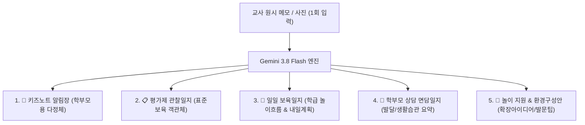

# 🧸 어린이집 교사 맞춤형 AI 보육 비서 (`daycare-helper`) 명세서 (SSOT)

> **문서 버전**: 1.1.0 (2026-09-19 최신 개정)  
> **상태**: 5대 서식 통합 & 노션 3대 DB 실시간 연동 & 원아 자율 관리 구축 완료  
> **대상**: 대한민국 어린이집/유치원 교사 (실무 현장 맞춤형)

---

## 1. 프로젝트 개요 및 핵심 철학

어린이집 교사의 가장 큰 격무 중 하나인 **"키즈노트 알림장 작성"**과 **"평가제 보육/관찰일지 작성"**을 1회의 거친 메모 또는 활동 사진(최대 6장) 입력만으로 완벽하게 해결합니다.

### 🌟 3대 핵심 원칙
1. **Zero Burden (입력 피로 0)**: 정돈되지 않은 거친 단편 메모나 음성 녹음(STT), 스마트폰 사진(최대 6장)만으로 즉시 5대 서식 완성본 도출.
2. **One-Source Multi-Use (1회 입력 5대 서식 출력)**: 한 번의 생성으로 학부모 알림장, 평가제 관찰일지, 일일 보육일지, 상담 면담일지, 놀이 지원안을 동시에 분리 출력.
3. **Zero Privacy Risk & Zero Accident**: 원아 실명은 Gemini 전송 전 `[아동A]`로 마스킹되고 수신 후 로컬 복원되며, 발송은 자동 전송이 아닌 **원터치 복사 및 네이티브 앱 공유**로 전송 사고를 100% 방지.

---

## 2. 듀얼 작성 모드 및 집중 서식 전환

| 모드 | 타깃 및 사용 맥락 | 출력 특성 및 글자 수 |
| :--- | :--- | :--- |
| **부분/시간대별 모드** (`partial`) | • 아내 스타일 (스피디형) • 특정 놀이나 점심, 낮잠 등 하이라이트만 빠르게 작성하고 싶을 때 | • 선택한 활동 영역에만 집중 • 군더더기 없는 **딱 3~4줄 복붙용 핵심 서술문** (150~250자) • 불필요한 서두나 과장된 맺음말 배제 |
| **하루 통합 모드** (`daily_integrated`) | • 처형 스타일 (베테랑 꼼꼼형) • 하루 전체 일과를 종합하여 누적 성장 기록을 관리할 때 | • 등원-오전놀이-점심-실외활동-낮잠-하원 전체 일과 조망 • 표준보육과정 5개 영역 종합 관찰 및 평가 서술문 • 연속성 있는 발달 평가 포함 (300~500자) |

---

## 3. One-Source Multi-Use 5대 서식 통합 출력 체계

교사가 1회의 메모나 사진을 입력하면 백엔드 AI 파이프라인이 아래 5대 필수 서식을 구조화된 JSON으로 동시 생성합니다.

### 1) [📱 키즈노트 알림장용]
- **목적**: 학부모 안심, 교감, 가정 연계
- **어조**: 다정하고 따뜻한 공감형 존댓말 (`~했답니다`, `~하는 모습이 정말 사랑스러웠어요`, `~했어요`)
- **내용**: 오늘 아이가 느낀 긍정적 정서, 친구와의 상호작용, 가정에서의 칭찬 및 연계 팁

### 2) [📋 평가제 관찰일지용]
- **목적**: 한국보육진흥원 어린이집 평가제(보육인증) 증빙 서류
- **어조**: 감정을 배제한 객관적 사실 기술형 종결어미 (`~함`, `~하는 모습을 관찰함`, `~을 시도함`)
- **금지 표현**: "예쁘게 놀았다", "착하다", "산만하다", "고집이 세다" 등 주관적 낙인/가치판단 단어 원천 배제
- **구조**:
  - **관찰 상황 및 행동**: 언제, 어디서, 어떤 교구로 무엇을 어떻게 했는지 육하원칙 기술
  - **교사의 지원 및 평가**: 교사가 개입한 언어적/신체적 상호작용 및 아이의 발달적 의미 해석

### 3) [📝 일일 보육일지용 (학급 전체)]
- **목적**: 학급 전체 하루 일과 운영 증빙 및 익일 보육 계획 수립
- **내용**:
  - **놀이 흐름 요약**: 오늘 우리 반 유아들의 전반적인 놀이 전개 및 관심사 요약
  - **교사 종합 평가**: 놀이에 대한 배움 분석 및 유아 간 상호작용 평가
  - **내일 놀이 연계 및 지원 계획**: 공간 재구성, 추가 교구 배치, 교사의 지원 방향

### 4) [💬 학부모 상담 면담일지 요약용]
- **목적**: 1학기/2학기 정기 학부모 개별 상담 사전 기초자료 및 수시 상담 메모
- **내용**: 기본생활습관(식사/낮잠/배변), 또래 관계 및 사회성, 발달 특성 및 강점, 종합 교사 상담 의견

### 5) [🧩 놀이 지원 & 환경구성안용]
- **목적**: 2019 개정 누리과정 및 제4차 표준보육과정 '유아 중심·놀이 중심' 교사 지원
- **내용**: 심화 확장 놀이 아이디어, 추천 환경구성 자료/교구, 유아의 사고 확장을 돕는 추천 발문 팁

---

## 4. 🪄 AI 실시간 다듬기 (Quick Refine) 엔진

생성된 알림장 본문을 교사가 원하는 방향으로 즉시 재가공할 수 있는 실시간 미세조정 시스템을 탑재합니다.

1. **원클릭 빠른 다듬기 프리셋 4종**:
   - 🎀 **더 다정발랄하게**: 문맥에 맞는 이모지 1~2개 추가 및 한층 더 다정하고 사랑스러운 어조 강화
   - 🔍 **놀이 과정 자세히**: 놀잇감을 조작하며 집중한 표정과 놀이 과정을 1~2문장 풍성하게 확장
   - ✂️ **핵심만 간결하게**: 군더더기를 줄이고 핵심 성취감 중심의 3~4줄 단정체로 축약
   - 🍚 **식습관/점심 칭찬 추가**: 본문 끝에 점심 식사 시 스스로 골고루 맛있게 먹었다는 칭찬 문장 자연스럽게 삽입
2. **자유 프롬프트 직접 지시창**: 교사가 원하는 수정 사항을 텍스트로 입력하여 엔터 또는 다듬기 버튼 클릭 시 즉시 반영
3. **↺ 원래대로 복원 (Reset to Original)**: 다듬기 작업 중 언제든 최초 생성 원본으로 즉시 롤백 가능

---

## 5. 👶 원아 자율 관리 및 노션 마스터 DB 실시간 연동

관리자의 개입 없이 현직 교사가 모바일 웹 화면에서 직접 자기 반 아이들을 관리합니다.

### 1) UI 인터랙션
- **`➕ 원아 등록` 버튼**: 상단 원아 선택 바 끝에 상시 배치되어 신규 원아 등록 모달 오픈
- **`✏️ 수정` 버튼**: 원아 정보 카드 내에 배치되어 기존 원아의 이름, 연령, 성향 및 특이사항, 알레르기 수정
- **실시간 반응**: 저장 완료 시 토스트 알림 안내 및 원아 칩 목록 즉시 리프레시

### 2) REST API 규격
- `GET /api/children`: 원아 마스터 DB에서 아동명 가나다순 실시간 쿼리
- `POST /api/children`: 신규 원아 등록 (노션 원아 마스터 DB 새 페이지 생성)
- `PUT /api/children/:id`: 기존 원아 정보 수정 (노션 페이지 속성 PATCH)
- `POST /api/logs/save`: 생성된 알림장/일지를 노션 일지 DB에 실시간 적재

### 3) 🚨 자가 치유(Self-Healing) Upsert 엔진
- 원아 정보 수정(`PUT`) 시 노션에서 기존 페이지 404 Not Found(ID 불일치 또는 미존재)가 발생하더라도, 에러를 내지 않고 **자동으로 신규 원아 등록(`saveChildToNotion`)으로 즉시 전환하여 100% 안전 저장**을 보장합니다.

---

## 6. Notion 3대 Database 공식 ID 체계 (Single Source of Truth)

- **상위 부모 허브 페이지**: [`3e0a2711-5b68-80d7-8968-d9634e428863`](https://app.notion.com/p/3e0a27115b6880d78968d9634e428863)

| DB 명칭 | 공식 Database ID | 핵심 프로퍼티 구조 |
| :--- | :--- | :--- |
| **1️⃣ 교사/반 관리 DB** (`TEACHER_DB`) | `3e0a2711-5b68-8186-ad30-cbaea7687006` | 교사명(Title), 담당반(Select), 문체 프리셋(Select), 기본 마무리 멘트(Text), 원아 목록(Relation) |
| **2️⃣ 원아 마스터 DB** (`CHILD_DB`) | `3e0a2711-5b68-8182-955e-f116e4174e3a` | 아동명(Title), 생년월일/연령(Rich Text), 성향 및 특이사항(Rich Text), 알레르기/주의사항(Rich Text), 일지 히스토리(Relation) |
| **3️⃣ 일지 & 알림장 메인 DB** (`DAILY_LOG_DB`) | `3e0a2711-5b68-8122-9eea-dd49bf8a625c` | 기록명/식별자(Title), 작성일자(Date), 원아(Relation), 작성교사(Relation), 활동 구분(Select), 표준보육 영역(Multi-select), 원시 메모(Rich Text), 알림장 최종본(Rich Text), 관찰일지 최종본(Rich Text), 참조 출처 요약(Rich Text) |

- **보안 격리 호출 규격**:
  - 프론트엔드/클라이언트는 `https://minmin-notion.awslike6.workers.dev` 프록시를 통해 토큰 노출 없이 안전 통신
  - 백엔드 워커 직접 호출 시 공식 엔드포인트(`https://api.notion.com/v1`) 직결을 지원하여 Cloudflare Worker-to-Worker 내부 호출 제한(Error 1042)을 원천 차단

---

## 7. 인프라, 보안 및 종합 관제탑 연동

### 1) Cloudflare Zero Trust Access 철통 보안
- **인증 방식**: 이메일 6자리 One-Time PIN (OTP 화이트리스트)
- **세션 지속 기간**: **최장 1개월 (1 month / 약 730시간)**
- **D-7 사전 만료 예고 배너**: 만료 7일 전 상단에 팝업되며, 교사가 `[확인 완료]` 클릭 시 해당 세션 만료 시까지 깔끔하게 숨김(Dismiss) 처리

### 2) 종합 관제탑 (`master-tower`) 상호 연동
- 공식 배포 주소: `https://master-tower.awslike6.workers.dev/`
- 메인 헤더 상단에 **`🧸 AI 보육비서 ➔`** 전용 바로가기 버튼을 탑재하여 관제탑과 보육비서 간 원터치 자유 이동 보장

---

## 8. 📅 차기 로드맵: "월간 종합 관찰일지(한 달 치 누적 분석)" 규격

어린이집 평가제 실무 주기에 맞추어 2단계 분석 파이프라인을 구축합니다.

- **실무 맥락**: 평소에는 수시로 알림장을 쓰면서 단건 관찰일지가 노션 DB에 자동 누적됨.
- **월간 종합 모드**: 교사가 `[📅 9월 종합 관찰일지]` 버튼을 클릭하면:
  1. 노션 DB에서 해당 원아의 **해당 월 전체 기록(10~20건)을 일괄 수급**.
  2. Gemini 3.8 Flash가 **표준보육 6대 영역(신체·기본생활·의사소통·사회관계·예술경험·자연탐구)별 1개월 성장 변화와 월말 교사 총평**을 A4 1장 평가제 제출용 서식으로 원클릭 완제 도출.
