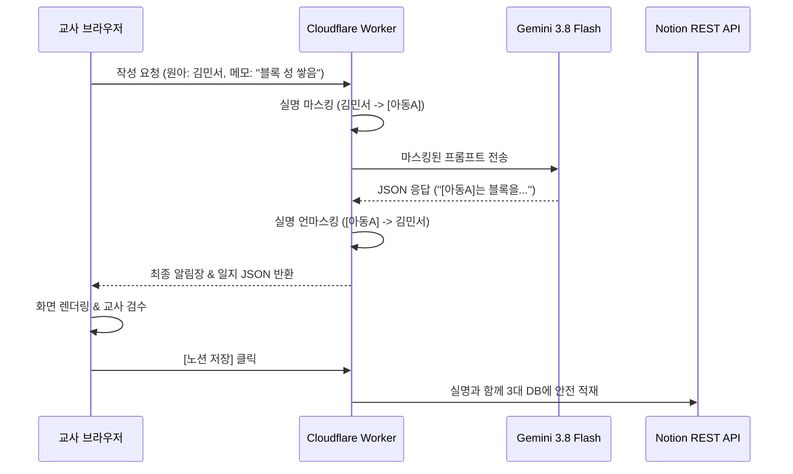

# 🧸 어린이집 교사 맞춤형 AI 보육 비서 (`daycare-helper`) 명세서 (SSOT)

> **문서 버전**: 1.0.0 (2026-09-19 기준)  
> **상태**: MVP 구현 완료 단계  
> **대상**: 대한민국 어린이집/유치원 교사 (실무 맞춤형)

---

## 1. 프로젝트 개요 및 핵심 철학

어린이집 교사의 가장 큰 격무 중 하나인 **"키즈노트 알림장 작성"**과 **"평가제 보육/관찰일지 작성"**을 1회의 거친 메모 또는 활동 사진(최대 6장) 입력만으로 완벽하게 해결합니다.

### 🌟 3대 핵심 원칙
1. **Zero Burden (입력 피로 0)**: 정돈되지 않은 거친 단편 메모나 음성 녹음(STT), 스마트폰 사진(최대 6장)만으로 즉시 완성본 도출.
2. **One-Source Multi-Use**: 한 번의 생성으로 **[학부모용 다정체 알림장]**과 **[평가인증용 객관체 일지]**를 동시에 분리 출력.
3. **Zero Privacy Risk & Zero Accident**: 원아 실명은 Gemini 전송 전 `[아동A]`로 마스킹되고 수신 후 로컬 복원되며, 발송은 자동 전송이 아닌 **원터치 복사 및 네이티브 앱 공유**로 전송 사고를 100% 방지.

---

## 2. 듀얼 모드 작성 엔진 상세 명세

| 모드 | 타깃 및 사용 맥락 | 출력 특성 및 글자 수 |
| :--- | :--- | :--- |
| **부분/시간대별 모드**<br>(`partial`) | • 아내 스타일 (스피디형)<br>• 특정 놀이나 점심, 낮잠 등 하이라이트만 빠르게 작성하고 싶을 때 | • 선택한 활동 영역에만 집중<br>• 군더더기 없는 **딱 3~4줄 복붙용 핵심 서술문** (150~250자)<br>• 불필요한 서두나 과장된 맺음말 배제 |
| **하루 통합 모드**<br>(`daily_integrated`) | • 처형 스타일 (베테랑 꼼꼼형)<br>• 하루 전체 일과를 종합하여 누적 성장 기록을 관리할 때 | • 등원-오전놀이-점심-실외활동-낮잠-하원 전체 일과 조망<br>• 표준보육과정 5개 영역 종합 관찰 및 평가 서술문<br>• 연속성 있는 발달 평가 포함 (300~500자) |

---

## 3. One-Source Multi-Use 출력 형식

### 1) [키즈노트 알림장용]
- **목적**: 학부모 안심, 교감, 가정 연계
- **어조**: 다정하고 따뜻한 공감형 존댓말 (`~했답니다`, `~하는 모습이 정말 사랑스러웠어요`, `~했어요`)
- **내용**: 오늘 아이가 느낀 긍정적 정서, 친구와의 상호작용, 가정에서의 칭찬 및 연계 팁

### 2) [평가제 관찰일지용]
- **목적**: 한국보육진흥원 어린이집 평가제(보육인증) 증빙 서류
- **어조**: 감정을 배제한 객관적 사실 기술형 종결어미 (`~함`, `~하는 모습을 관찰함`, `~을 시도함`)
- **금지 표현**: "예쁘게 놀았다", "착하다", "산만하다", "고집이 세다" 등 주관적 낙인/가치판단 단어 원천 배제
- **구조**:
  - **관찰 상황 및 행동**: 언제, 어디서, 어떤 교구로 무엇을 어떻게 했는지 육하원칙 기술
  - **교사의 지원 및 평가**: 교사가 개입한 언어적/신체적 상호작용 및 아이의 발달적 의미 해석

---

## 4. 과거 기록 연계 및 참조 출처(Citation) 표기

- 시스템은 원아 선택 시 Notion DB에서 해당 원아의 **최근 2~3회 관찰일지**를 비동기 수급하여 프롬프트 컨텍스트에 주입합니다.
- Gemini 3.8 Flash는 이전 기록 대비 **변화점 및 성장 추이**(예: 낯가림 완화, 가위질 조절력 향상 등)를 서술문에 자연스럽게 반영합니다.
- 교사가 출처를 투명하게 인지할 수 있도록 다음과 같이 표기합니다:
  > **`📌 참고한 과거 기록: [2026-09-05] 가위질 미숙 기록 대비 양손 협응력 향상 관찰됨`**

---

## 5. 개인정보 안심 가드 (실명 마스킹)



---

## 6. Notion 3대 Database 스키마 상세

```
[1️⃣ 교사/반 관리 DB] (TEACHER_DB)
 ├── 교사명 (Title)
 ├── 담당반 (Select: 만 0세반, 만 1세반, 만 2세반, 만 3세반, 만 4세반, 만 5세반 등)
 ├── 문체 프리셋 (Select: 다정친절체 / 단정격식체 / 활발발랄체)
 └── 기본 마무리 멘트 (Text: "가정에서 따뜻한 주말 보내세요^^")

[2️⃣ 원아 마스터 DB] (CHILD_DB)
 ├── 아동명 (Title)
 ├── 생년월일/연령 (Date / Text)
 ├── 성향 및 특이사항 (Rich Text: 소근육 발달, 공룡 놀이 몰입 등)
 ├── 알레르기/주의사항 (Rich Text: 갑각류 알레르기 등)
 └── 일지 히스토리 (Relation -> 3️⃣ 일지 메인 DB)

[3️⃣ 일지 & 알림장 메인 DB] (DAILY_LOG_DB)
 ├── 기록명/식별자 (Title: [YYYY-MM-DD] 김민서 - 자유놀이)
 ├── 작성일자 (Date)
 ├── 원아 (Relation -> 2️⃣ 원아 DB)
 ├── 작성교사 (Relation -> 1️⃣ 교사 DB)
 ├── 활동 구분 (Select: 자유놀이, 식습관/점심, 낮잠/배변, 실외놀이, 미술/감각, 하루통합)
 ├── 표준보육 영역 (Multi-select: 신체운동·건강, 의사소통, 사회관계, 예술경험, 자연탐구)
 ├── 원시 메모/키워드 (Rich Text)
 ├── 알림장 최종본 (Rich Text)
 ├── 관찰일지 최종본 (Rich Text)
 ├── 참조한 과거 일지 (Relation -> 3️⃣ 자기 자신)
 └── 참조 출처 요약 (Rich Text)
```
