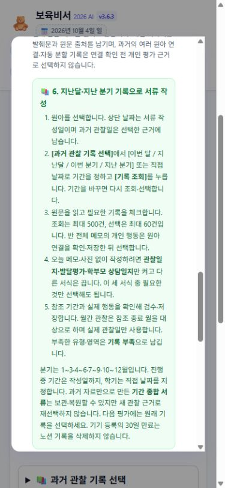
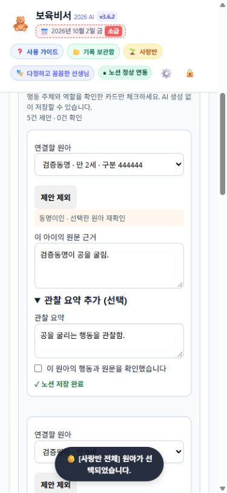
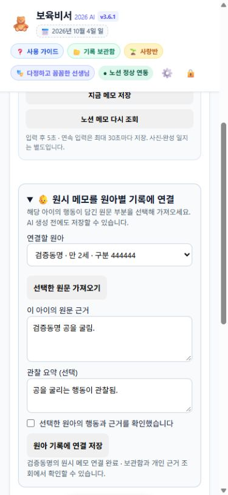
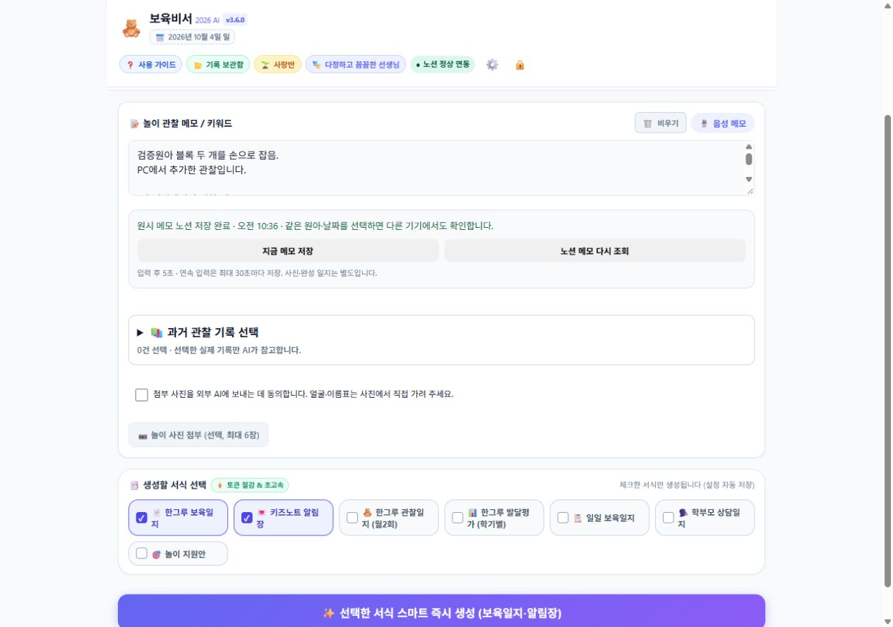
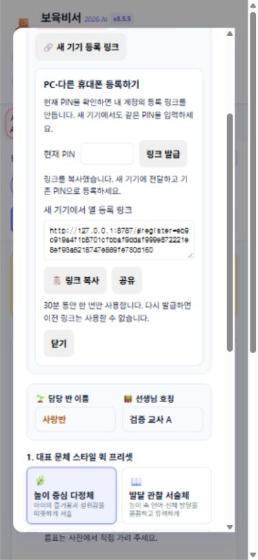
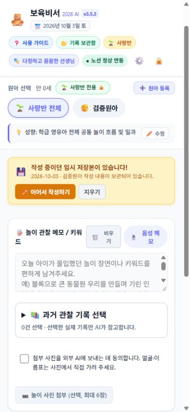
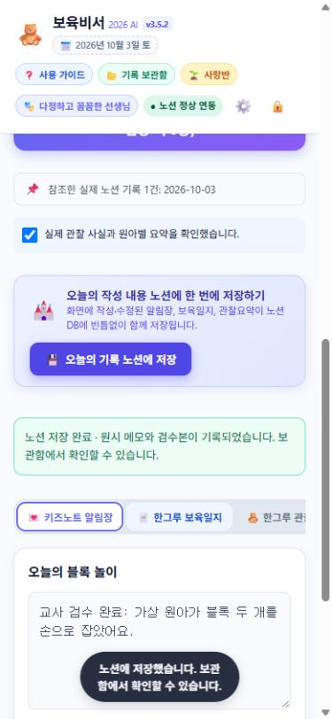
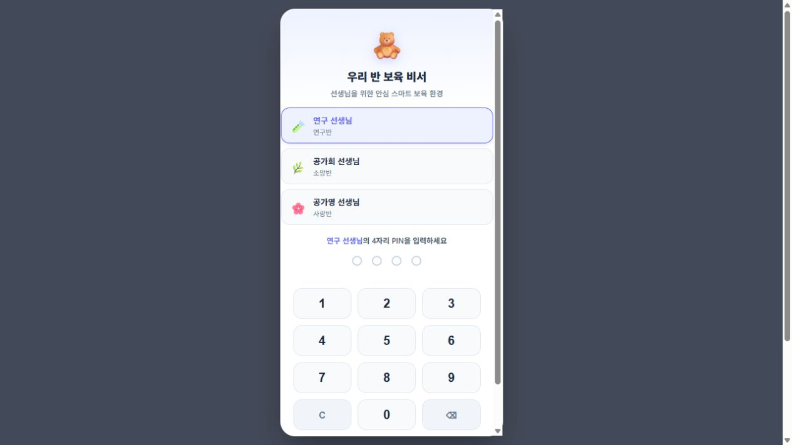
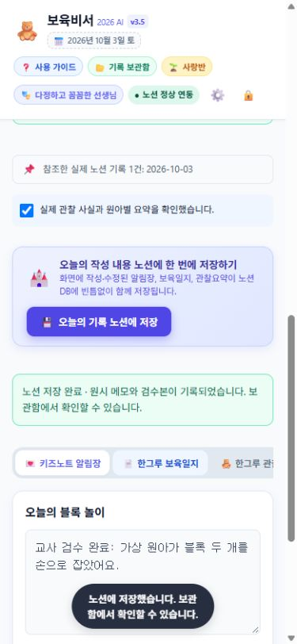

# 보육비서 개선·현장 오류 검증 보고서

## 사용 가이드 현행화 · 3.6.3 · 2026-10-04

- 앱 안 teacherGuideModal과 docs/teacher_guide.md를 현재 동작에 맞췄습니다. 오래된 저장 버튼 이름을 수정하고, 원시 메모 자동 저장·AI 생성·검수본 저장 및 중복 선택의 결과를 구분했습니다.
- 월·분기의 작성일/관찰일·분기 범위·종료 월·직접 근거 선택·60건/500건 제한·과거 자료만의 세 서식·기록 부족·기간 종합본 재사용 제한을 단계별로 추가했습니다. 10월 4일의 지난 분기와 9월 월간 작성 예시를 넣었습니다.
- 확인되지 않은 퇴근 1시간 단축, 홈 화면 아이콘에서 자동 바로녹음, 상·하순 강제 관찰, 보관함의 항상 가능한 HWP 출력 안내를 삭제·수정했습니다. 홈 화면 설치의 지원 차이, 사진 가림·동의, 미기록과 행동 부재 구분, 재생성 전 수정 문장 보관을 안내합니다.
- 중복된 기간 안내를 합쳤고 교사용 문서의 관리자 명령은 docs/CORE_CATALOG.md로 옮겼습니다. 상세 데이터 복사·인쇄와 복원 후 현재 서식의 출력도 구분합니다.
- 가상 교사 화면에서 열기·확인 완료·닫기·재열기를 확인했습니다. 모바일 390×844의 가이드 폭 320/320px, 문서 폭 375/375px, PC 1280×900의 가이드 폭 585/585px, 문서 폭 1265/1265px로 가로 넘침이 없습니다. 회귀 80개, 실제 JavaScript 파서·800줄 상한·git diff --check 통과했습니다.
- 최종 공개 HTML의 전사 scripts/ai_verify.py Gemini 검사도 통과했습니다. 기능 버전은 v3.6.3을 유지하며 가이드 정적 파일 캐시를 20261004_v51로 갱신했습니다. Worker 96a76e3c-20f5-4489-b1ea-59af8aec3bbb에 운영 반영 후 공개 파일 9종 HTTP 200/no-cache·SHA-256 일치 및 기존 인증 경계를 확인했습니다.

PC 화면: [teacher-guide-desktop.png](docs/verification/teacher-guide-desktop.png)

---

## 누적 기억으로 월·분기 서류 작성 · 3.6.3 · 2026-10-04 · 운영 배포 완료

### 확인한 목적과 보완 내용

- 장기기억의 원천은 노션의 원아·날짜별 원시 메모와 교사가 검수한 기록입니다. 로그인 기기의 30일 등록 기간과 별개로 저장 기록은 유지됩니다. AI가 지난 대화를 기억하는 방식이 아니라 선택한 실제 기록을 매번 조회해 작성합니다.
- 기존 생성은 오늘 메모가 필수였고 참조 종료일을 작성일로 처리했습니다. 오늘 입력 없이도 실제 과거 기록을 선택하여 월간 관찰일지·기간 발달평가·상담 준비 초안을 만들 수 있도록 기존 흐름을 보완했습니다. 일일 서식에는 현재 관찰 자료가 필요합니다.
- 이번 달·지난달·이번 분기·지난 분기 버튼과 시작·종료일 검증을 추가했습니다. 선택 기간을 초안·저장본·복원·복사에 유지하고 기간 변경 시 이전 선택과 늦은 응답을 무효화합니다.
- 월간 서식은 대상 월에 실제 기록된 관찰일만 사용합니다. 놀이를 일상생활 사건으로 바꾸거나 작성일을 관찰일로 채우지 않습니다. 자료가 없으면 날짜를 비우고 기록 부족을 표시합니다. 발달평가는 실제 선택 기간을 제목에 표시하며 학기·성장·지도 효과를 강제로 만들지 않습니다.
- 과거 자료만으로 만든 결과는 [기간종합]으로 구분하고 새 관찰 근거로 재선택하지 못하게 했습니다. 관찰 원문과 기간 종합본, 서로 다른 기간의 덮어쓰기는 서버가 거부합니다. 기존 관찰 저장·원아 연결·메모 동기화 기능은 재사용했습니다.
- 관찰일지 전문 복사의 빈 내용 문제를 수정했습니다. 검수한 화면의 실제 월·관찰일·부족 기록을 복사합니다. 저장본 복원 시 선택 근거·기간과 작성 가능한 상태를 함께 복원합니다.

### 검증 근거

- node --test tests/*.test.js: 80개 통과. 기간 기반 생성·범위 밖 근거/가짜 관찰일 거부·종합본 재사용 거부·원문 덮어쓰기 보호·기간 보존·연도 경계·늦은 조회 응답을 포함합니다.
- 실제 Gemini에 개인정보가 없는 가상 0세 관찰 기록으로 두 가지 사례를 요청했습니다. 7~9월의 블록 행동과 숟가락 행동은 원문으로 유지했고 식사량·수면·실제 상담 합의를 만들지 않았습니다. 놀이 기록만 있는 사례는 일상생활 날짜를 비워 기록 부족으로 표시했습니다.
- 처음 생성에서 '말소리를 기록하지 않음'을 행동 부재처럼 해석하는 표현을 발견했습니다. 미기록과 행동 부재를 구분하는 지침을 보완한 뒤 재생성하여 원문 의미 보존을 확인했습니다. 생성 품질은 교사 검수가 계속 필요합니다.
- 실제 AI 응답: [기간 종합 사례](docs/verification/period-ai-20261004.json), [놀이 기록만 있는 사례](docs/verification/period-ai-play-only-20261004.json). 두 파일은 가상 자료 검증 결과이며 운영 원아 기록이 아닙니다.
- 로컬 가상 교사 화면에서 지난 분기 3건 선택→생성→교사 문장 수정→검수 체크→새 종합본 저장→보관함 복원과 기간/근거 보존을 확인했습니다. 발달평가의 일반/HWP 복사와 월간 관찰일지 전문/한그루 복사의 실제 클립보드 내용도 확인했습니다.
- 모바일 390×844와 PC 1280×900에서 문서/스크롤 폭이 각각 375/375px, 1265/1265px로 가로 넘침이 없었습니다. 화면은 가상 서비스의 생성 결과와 교사 검수 문장으로 구성했습니다.
- 공개 HTML의 전사 scripts/ai_verify.py Gemini 검사도 통과했습니다. 운영 v3.6.3 / 20261004_v50, Worker 72f1787c-8df0-4d55-8b53-b99e1c53ac27 배포 후 공개 파일 9종 HTTP 200/no-cache·SHA-256 일치를 확인했습니다. 비로그인 생성·이력·원아 연결은 401, 외부 출처 생성은 403으로 거부합니다.
- 최초 배포 시 CLI 인증이 없어 진행되지 않았으며 사용자가 Cloudflare 로그인·승인을 직접 완료한 뒤 기존 Worker에 배포했습니다. 운영 PIN·원아 기록을 변경하는 검증은 이번 배포 과정에서 실행하지 않았습니다.
- 선택적 기존 종합본 덮어쓰기 화면 검증은 자동 승인 검토가 명시적 덮어쓰기 승인 부족으로 거절하여 취소했습니다. 새 저장·복원 검증과 서버의 덮어쓰기 보호 테스트는 완료했습니다.

모바일 화면: [period-review-mobile.jpg](docs/verification/period-review-mobile.jpg)

### 현재 상태와 남은 실제 사용 확인

- 운영 v3.6.3 / v50입니다. 구현 커밋은 5e23cf8이며 배포 전 필수 검사와 배포 후 공개 파일·인증 경계 검증을 완료했습니다.
- 근거는 교사가 직접 선택하며 한 번에 최대 60건, 조회는 최대 500건입니다. 장기 전체 이력을 자동으로 압축·갱신하는 별도 기억 기능은 없습니다. 기록이 많으면 기간을 좁혀 선택합니다.
- 실제 교사 피드백, 한글 프로그램에 붙여넣은 표, 실제 출력물과 시간 절감은 아직 확인하지 않았습니다. 원문의 정확한 행동 주체·미기록·지원 계획을 검수한 뒤 사용합니다.

---

## 이름별 문장 자동 제안·교사 검수 일괄 저장 · 3.6.2 · 2026-10-04

### 변경한 내용과 원인

- 기존 원아 연결은 교사가 반 전체 메모를 훑어 직접 발췌하는 수고가 남았습니다. 반 전체를 선택하고 이름이 있는 메모를 입력하면 담당반의 실제 원아 목록으로 문장을 찾아 카드에 원문 그대로 제안합니다. 이름 탐색은 브라우저에서 실행하며 AI 호출이 없습니다.
- 실명·성 없는 이름 약칭·조사를 대조하며 동명이인은 선택을 비웁니다. 약칭·공동 문장에는 원아/행동 역할 확인을 표시합니다. 이름이 언급됐다는 이유로 그 아이의 행동을 생성하거나 확정하지 않습니다.
- 쉼표 뒤 새 이름이 주어/독립 키워드로 시작하면 나누고 상대에게 이어지는 공동 문장은 유지합니다. 이름 없는 이어지는 문장·반 공통 활동은 별도 목록에 남기며 수동 후보로 추가할 수 있습니다. 반복 문장은 중복 제안하지 않고 후보 100건 상한을 표시합니다.
- 교사가 원아·원문 범위·선택 요약을 수정하고 확인한 카드만 한 번에 저장합니다. 기존 원문 확보·/api/logs/link-child·MemoStore 큐를 재사용합니다. 개인 원문에는 해당 발췌만 남고 전체 원문과 출처는 보존합니다. 일부 실패 시 성공 행과 남은 확인 항목을 구분합니다.
- 수정 카드·원아 선택·저장 상태는 기존 AES-GCM 초안에 포함합니다. 원문 변경·카드 수정·복원 때 확인을 해제하고 저장 중 수정과 잠금 후 늦은 응답을 격리합니다. 노션 조회·STT·충돌 선택·초안 복원과 연결했으며 반 전체 초안의 대상 복원과 조회 후 카드 복원을 보완했습니다.

### 실제 확인한 결과

- node --test tests/*.test.js: 74개 전부 통과. 새 12개 검증은 실명/약칭/조사·동명이인·공동 역할·일반 단어 부분 일치·쉼표 분리·반복/상한·확인 항목 일괄 저장·잘못된 근거/수동 후보·수정/복원·일부 실패·연속 탭·늦은 응답·저장 중 수정·조회 후 복원·다른 저장 중 버튼 잠금을 포함합니다.
- 실제 Node 구문·프론트 800줄 상한·git diff --check 통과. child-links.js는 329줄로 기존 연결 모듈에 통합했습니다. 이미 승인한 공개 HTML의 전사 scripts/ai_verify.py Gemini 검사도 통과했습니다.
- 실제 가상 교사 브라우저에서 반 전체 메모 입력→원문 후보 4건/미연결 문장 2건→동명이인 미선택 거부→두 번째 동명이인 ID·요약 수정→확인한 두 카드 일괄 저장을 확인했습니다. 개인 근거 조회에는 해당 원아 발췌 1건만 나타났습니다. 재진입 후 원문·원아 선택·수정 요약·저장 상태 복원과 확인 해제, 이름 없는 다음 문장의 미선택 수동 후보 추가도 확인했습니다.
- 모바일 390×844의 문서/스크롤 폭 375/375px, PC 1280×900의 두 폭 1265/1265px로 가로 넘침이 없었습니다. PC는 두 열, 모바일은 한 열 카드로 표시됩니다. 실제 사용자 PIN·원아 데이터는 사용하지 않았습니다.
- 운영 v3.6.2 / 20261004_v49, Worker 8255aad6-6792-4a9c-b5e8-9811bf056b26 배포 완료. 공개 파일 9종 HTTP 200/no-cache·SHA-256 일치, 비로그인 연결 401·외부 출처 요청 403을 확인했습니다.
- 운영 연구반 새 가상 원아 두 명의 실제 노션 관계·발췌·개인 조회·동일 행 재시도·잘못된 발췌 거부가 통과했습니다(exactChildRelations=true, isolatedExcerpts=true, retrySamePage=true, invalidExcerptRejected=true, source=notion, ai=false). 검증 원아·일지는 모두 보관 처리했습니다.

PC 두 열 카드: [name-suggestions-desktop.png](docs/verification/name-suggestions-desktop.png)

### 한계와 사용 조건

- 이름이 언급된 문장의 실제 행동 주체·상대 역할은 교사가 확인합니다. 원문을 그대로 제안하고 확인한 카드만 저장합니다. 공통 활동을 모든 아이에게 자동 귀속하지 않습니다.
- 임의 애칭·오탈자·이름과 겹치는 일반 단어·문장부호 없는 긴 음성 전사는 누락/과도한 범위를 만들 수 있습니다. 아이별 줄바꿈이나 정확한 원문 범위 수정으로 확인합니다. 선택 요약은 실제 관찰만 교사가 작성하며 사진만으로 새 원문을 지어내지 않습니다.
- 카드 검수 초안은 기기 전용입니다. 다른 기기에 공유되는 원시 메모와 검수 저장 완료 기록을 구분합니다. 연결의 같은 발췌 요약을 여러 기기에서 편집하는 별도 버전 선택 화면은 이번 범위에 포함하지 않습니다. 종료 순간 저장·교사의 실제 시간 절감·한그루 결과까지 보장했다고 보고하지 않습니다.

---

## 원아별 원문 근거와 정확한 연결 · 3.6.1 · 2026-10-04

### 변경한 내용과 원인

- 이전 개별 저장은 생성된 이름과 같은 첫 원아를 고르고 개인 원시 메모에 반 전체 메모를 넣었습니다. 동명이인 오연결과 다른 아이의 행동이 개인 평가 근거에 섞일 위험이 있었습니다.
- 실제 노션 원아 ID로 선택하고 오늘 저장된 원문에서 해당 아이의 발췌만 개인 기록에 저장합니다. 교사·반·날짜·원문 일치·발췌·확인 체크를 서버에서 검증합니다. 원아가 지정된 원문을 다른 아이에게 옮기지 않습니다.
- 원시 메모 화면에서도 AI 없이 연결할 수 있습니다. 생성된 개별 카드에는 원아 선택·정확한 원문 근거·관찰 요약·항목 확인을 제공합니다. 동명이인/알 수 없는 가명은 자동으로 첫 아이를 선택하지 않으며 확인 체크는 복원 후 다시 받습니다.
- [원아연결:…] 기록의 기존 원아 관계와 원시 메모 속성을 사용하고 검수 JSON의 child_link에 원문 ID·URL·날짜·해시·발췌·확인 교사/시각을 보존합니다. 같은 원문·원아·발췌는 기존 MemoStore 큐에서 재조회하여 같은 행을 사용합니다. 미확인 쓰기는 pending으로 보존하며 자동으로 새 행을 다시 만들지 않습니다.
- 개인 근거에는 정확히 한 원아의 실제 연결만 허용합니다. 여러 관계·조회되지 않는 원아·이전 반 전체 메모 자동 분할은 연결 확인 필요로 표시하고 생성 API도 선택을 거부합니다. 기존 데이터를 추측해 소급 변경하지 않았습니다.

### 실제 확인한 결과

- node --test tests/*.test.js: 62개 전부 통과. 새 10개 검증은 실제 workerd에서 동명이인의 두 번째 ID 연결·발췌 격리·개인 조회·개인 근거 생성·인증/원문 조작 거부·동시 재시도·요약 수정·응답 유실·다중 관계/이전 분할 거부와 화면의 확인 누락·연속 탭·잠금 후 늦은 응답·저장 중 수정 보존을 포함합니다.
- 실제 Node 구문·프론트 800줄 상한·git diff --check 통과. 새 child-links.js는 149줄이며 기존 이름 검색·카드 중복 코드를 공통 모듈로 연결했습니다. 승인된 공개 HTML의 전사 scripts/ai_verify.py 검사도 통과했습니다.
- 가상 노션·가상 교사만 쓰는 브라우저에서 원문 없는 관찰 거부→두 번째 동명이인 선택·발췌 저장→생성 카드의 후보 ID·정확한 발췌 확인·검수 저장→원아 변경·개인 근거 조회→해당 기록 1건 선택·생성의 출처 표시를 확인했습니다. 선택한 원문 가져오기와 암호화 초안 재진입 후 원아·발췌 복원·확인 해제를 확인했습니다. 사용자 PIN·실제 원아 기록은 사용하지 않았습니다.
- 모바일 390×844의 문서/스크롤 폭 375/375px, PC 1280×900의 두 폭 1265/1265px로 새 입력/카드에 가로 넘침이 없었습니다.
- 운영 v3.6.1 / 20261004_v48, Worker c171beb9-c8ea-453d-b3ef-6ae2fc5af600 배포 완료.
- 변경한 공개 파일 9종은 HTTP 200/no-cache이며 SHA-256이 로컬과 일치합니다. 비로그인 원아 연결은 401, 외부 출처 요청은 403으로 거부했습니다.
- 운영 연구반에 새 가상 원아 두 명과 별도 원문을 만들어 AI 없이 발췌 저장→실제 노션 관계/원문 재조회→개인별 이력 조회를 확인했습니다. exactChildRelations=true, isolatedExcerpts=true, retrySamePage=true, invalidExcerptRejected=true, source=notion으로 응답했습니다. 검증 원아·일지는 모두 보관 처리했으며 기존 교사 기록을 수정하지 않았습니다.

생성 카드의 PC 검수 저장: [child-links-desktop.png](docs/verification/child-links-desktop.png)

### 한계와 사용 조건

- 문장이 실제로 어느 아이의 행동인지는 교사가 확인합니다. 원문에 여러 아이가 들어간 부분을 그대로 모두 선택하지 않고 해당 아이의 문장만 발췌합니다. 원문 일치 검사는 문장의 사실 여부를 자동 판정하지 않습니다.
- 사진만 있는 관찰은 메모 근거를 보완해야 연결할 수 있습니다. 수정된 원문과 이미 연결한 과거 발췌는 자동으로 함께 변경하지 않습니다.
- 개인 메모·검수 요약 연결을 제공하며 여러 기기의 동일 연결 요약 편집에 대한 별도 버전 선택 화면은 포함하지 않습니다. 장기간 미확인 쓰기는 관리자 확인이 필요합니다. 생성 품질·실제 한그루 붙여넣기·교사의 사용 시간 단축을 보장했다고 보고하지 않습니다.

---

## 원시 메모 노션 자동 저장·기기 공유 · 3.6.0 · 2026-10-04

### 구현한 흐름

- 입력 5초 대기·연속 입력 최대 30초마다 AI 없이 원시 메모를 노션에 저장합니다. 화면 숨김/pagehide 때 keepalive 추가 전송을 시도하며 대상별 AES-GCM 기기 대기본을 함께 보관합니다. 종료 순간의 전송은 보장하지 않습니다.
- 같은 교사의 PC에서 같은 원아·날짜를 선택하면 노션 메모를 읽습니다. 최초 진입·대상 변경·화면 복귀·활성 화면 30초마다 조회하며 즉시 저장/조회 버튼을 제공합니다.
- MemoStore는 대상별 직렬 쓰기·버전 비교·동일 내용 생략·불명확 응답 재조회를 담당합니다. 다른 기기 또는 노션에서 수정한 내용은 409와 현재 원문으로 반환하며 프론트는 두 메모 확인·합치기/노션 메모 사용을 제공합니다.
- 자동 메모 전용 행은 기존 노션 속성을 재사용합니다. 검수 최종본과 분리하며 보관함·근거 선택에서 원문을 읽습니다. 입력창 비우기는 노션 삭제로 연결하지 않고 반 전체 메모를 자동으로 모든 원아에게 분할하지 않습니다. 사진·완성 서식의 자동 동기화는 포함하지 않습니다.
- 문서/앱 가이드를 자동 저장·PC 등록·반 인증·7종 서식·검수 흐름으로 동기화하고 근거 없는 4초·1초·100% 양식/말투 보장 문구를 정리했습니다.

### 실제 확인한 결과

- node --test tests/*.test.js: 52개 모두 통과. 새 검사 12개는 프론트 대기 시간·암호화·다른 기기 조회·동시 편집 합치기·오프라인 재진입·날짜 격리·빈 내용 보호·keepalive·잠금/재로그인 뒤 늦은 응답이 새 초안을 지우지 않는 경우와 실제 workerd의 두 기기 쿠키·노션 쓰기/조회·경합 409·반 격리·응답 유실·명확한 거부 후 재시도를 포함합니다.
- Node 실제 파서와 프론트 800줄 상한 통과. 새 memo-sync.js는 219줄이며 기존 파사드에 연결했습니다. Worker dry-run도 AuthStore/MemoStore·기존 노션 서비스 바인딩을 포함하여 성공했습니다. GitHub 자동 검사에 새 메모 모듈 구문 검사를 추가했습니다.
- 가상 노션과 가상 교사만 사용하는 실제 브라우저에서 모바일 입력 후 자동 노션 저장 표시→127.0.0.1과 localhost의 서로 다른 쿠키/등록 기기에서 같은 원아·날짜 조회→두 기기 동시 수정 시 자동 덮어쓰기 중단→두 메모 합치기→저장→최신 v3.6.0 재진입 복원을 확인했습니다. 실제 사용자의 PIN·원아 기록은 사용하지 않았습니다.
- 모바일 390×844의 문서/스크롤 폭 375px, 충돌 화면 390/390px, PC 1280×900의 두 폭 1265px로 가로 넘침이 없었습니다. 사진·AI 생성·교사의 실제 한그루 붙여넣기는 이번 확인 범위에 포함하지 않습니다.
- 사용자가 공개 HTML의 Gemini 검사 전송을 승인한 뒤 전사 scripts/ai_verify.py 검사가 실제로 통과했습니다. 원시 메모·사진·PIN·비밀값은 검사 본문에 보내지 않았습니다.
- 운영 v3.6.0 / 20261004_v47 배포 완료. Worker 버전 62bf2ddd-cfcf-4fe0-8e71-437a5ae02b0c. 변경한 공개 파일 7종은 HTTP 200/no-cache이며 SHA-256이 로컬과 일치합니다. 비로그인 메모 조회·저장은 401, 외부 출처 저장은 403, 공개 상태 조회는 200으로 확인했습니다.
- 운영 연구반에 새 가상 원아를 생성해 AI 호출 없이 원시 메모 저장→같은 노션 행 수정→Worker 재조회와 노션 직접 재조회를 확인했습니다. 응답은 memoWriteRead=true, memoUpdateSamePage=true, source=notion이며 가상 원아·일지는 모두 보관 처리했습니다. 실제 교사의 원아 기록을 수정하지 않았습니다.

모바일 저장 화면: [memo-sync-mobile.png](docs/verification/memo-sync-mobile.png) · 동시 수정 확인: [memo-sync-mobile-conflict.png](docs/verification/memo-sync-mobile-conflict.png)

### 한계와 대응

- 인터넷·브라우저 기기 저장소·암호화 이전 강제 종료까지 완전 복구를 보장하지 않습니다. 노션 저장 완료를 확인하며 미전송 초안은 브라우저 데이터를 지우지 않고 재진입합니다.
- 응답을 확인하지 못한 노션 쓰기는 먼저 변경 ID 반영을 조회합니다. 장기간 확인되지 않는 pending은 관리자 확인이 필요하며 확인 전 다른 내용을 덮어쓰거나 새 자동 행을 만들지 않습니다.
- 메모만 있는 오래된 기기 초안은 공유본과 비교하고 사진·검수 문서가 있는 기존 초안은 교사의 복원 선택을 유지합니다. 근거 부족을 가짜 관찰·AI 요약으로 채우지 않습니다.

---

## 새 기기 등록 링크 직접 발급 · 3.5.5 · 2026-10-04

### 사용 흐름과 보호 조건

- 등록된 기기에서 설정 → 새 기기 등록 링크 → 현재 PIN 확인 → 링크 발급·복사 → 새 기기에서 기존 PIN으로 등록하는 흐름을 추가했습니다. 지원하는 브라우저에는 공유 버튼도 표시합니다.
- 기존 AuthStore의 초대·PIN 검증을 재사용했습니다. 서버는 유효 기기·세션·현재 PIN과 실제 노션 담당반을 확인하고 다른 교사·학급으로 바꾼 요청은 발급 대상에 사용하지 않습니다. 관리자 비밀값을 클라이언트에 보내지 않습니다.
- 직접 발급 링크는 30분·일회용이며 같은 발급 기기에서 재발급하면 이전 링크는 무효화됩니다. 발급 기기 등록 해제·만료·PIN 변경 뒤 미사용 링크도 거부합니다. 기존 기기 등록과 30일 자동 연장은 유지됩니다.
- PIN·링크는 브라우저 저장소에 보관하지 않습니다. 설정 닫기·잠금·교사 전환 시 화면과 요청·타이머를 정리하고 늦은 응답을 숨깁니다. 복사 권한 거부는 수동 복사를 안내하고 만료된 링크는 화면에서 지웁니다.

### 실제 확인한 결과

- node --test tests/*.test.js: 40개 모두 통과. 실제 workerd에서 직접 발급→새 기기 등록→세션, 기기·세션 누락, 외부 출처·GET 거부, 잘못된 PIN·5회 제한, 다른 교사·학급 위조, 재발급·30분 만료·중복 사용·발급 기기 해제·만료·PIN 변경 후 무효화를 확인했습니다.
- 브라우저는 실제 노션과 분리한 가상 교사·PIN·서비스를 사용했습니다. 모바일 설정에서 잘못된 PIN 안내→재시도→발급→복사 성공과 클립보드의 링크 일치를 확인했습니다. 127.0.0.1과 localhost의 분리된 쿠키 환경으로 새 기기 흐름을 구성하여 복사한 링크·기존 가상 PIN으로 사랑반 진입, 다른 반 선택 비활성화, 등록 후 fragment 제거를 확인했습니다.
- 설정 닫기 후 PIN·링크 값이 비고 패널이 숨겨짐을 DOM에서 확인했습니다. 회귀 검증에서도 연속 발급 제한·만료 안내·복사 권한 거부·영구 저장 없음·잠금 뒤 늦은 응답 차단이 통과했습니다.
- 모바일 390×844에서 문서/스크롤 폭 모두 375px, PC 1280×900에서 두 폭 모두 1265px로 가로 넘침이 없습니다. 임시 화면 크기는 검증 뒤 해제했습니다.
- 실제 Node 문법·프론트 코어 800줄 상한·git diff --check 통과. 전사 scripts/ai_verify.py의 공개 index.html 검증도 통과했습니다.
- 운영 v3.5.5 / 20261004_v46 배포 완료. Worker 버전 29a211ab-e9ba-44f7-9e4e-6a2208e3036f. 변경한 HTML·인증 JS·app.js·CSS는 HTTP 200/no-cache이며 SHA-256이 로컬과 일치합니다. 비로그인 직접 발급 401, 관리자 비밀값 없는 기존 초대 403을 확인했습니다.

PC 발급 화면: [self-invite-desktop.png](docs/verification/self-invite-desktop.png) · 새 기기 진입: [self-invite-new-device.png](docs/verification/self-invite-new-device.png)

증거 이미지의 링크는 로컬 가상 저장소의 검증용이며 운영 등록 링크가 아닙니다. 사용자 PIN을 입력하거나 변경하지 않았고 실제 휴대폰의 네이티브 공유 앱·운영 AI 생성·실제 교사 노션 저장까지 검증했다고 보고하지 않습니다. 등록된 기기가 없는 경우의 최초 관리자 링크 발급은 계속 필요합니다.

---

## PIN 인증 시 기기 등록 30일 자동 연장 · 3.5.4 · 2026-10-04

### 적용한 동작

- 유효한 등록 기기에서 기존 PIN 인증과 세션 저장이 성공하면 서버의 기기 만료 시각과 HttpOnly 기기 쿠키를 그때부터 30일 연장합니다. 기존 기기도 배포 후 다음 PIN 로그인부터 적용됩니다.
- 단순 조회·기존 세션 확인·틀린 PIN·다른 교사 선택·시도 제한은 연장하지 않습니다. 30일 동안 PIN 인증하지 않거나 등록을 해제한 기기는 새 링크와 기존 PIN으로 등록합니다.
- 로그인 유지 옵션은 세션의 최대 수명만 선택합니다(선택 30일, 미선택 1일). 기기 연장과 별개이며 1시간 미사용 잠금은 유지합니다. 화면과 사용 가이드의 문구를 실제 정책에 맞췄습니다.
- 휴대폰·PC와 각 브라우저는 별도로 등록해 같은 교사의 PIN을 사용할 수 있습니다. 새 등록으로 기존 기기가 해제되지 않으며 기기 연장·해제는 각각 독립적입니다. 노션 저장본은 조회할 수 있지만 작성 중 기기 초안을 자동 동기화하지 않습니다.

### 확인한 결과

- node --test tests/*.test.js: 실제 workerd 통합 검증을 포함한 32개 전부 통과. 서버와 쿠키의 30일 일치, 기존 만료일 이후 재로그인, 옵션 해제 시 기기 30일·세션 1일, 실패 미연장, 만료·해제 거부, 여러 기기 등록 유지·독립 연장과 한 기기 해제 후 다른 기기의 세션 유지를 확인했습니다.
- 검증용 Worker와 가상 노션·교사·PIN만 사용했습니다. 기기 만료 제어는 독립 로컬 저장소에만 존재하며 운영 Worker가 해당 모듈을 가져오지 않습니다. 사용자 PIN을 받거나 대신 입력하지 않았습니다.
- 모바일 390×844에서 문서/스크롤 폭 375px, PC 1280×900에서 두 폭 모두 1265px로 가로 넘침이 없습니다. 가상 교사의 PIN 로그인·초안 복원 안내·설정의 자동 연장 문구와 세션 만료 표시를 확인했습니다.
- scripts/verify_js_modules.py의 실제 Node 문법·800줄 제한, 서버·검증용 Worker 구문 검사와 git diff --check가 통과했습니다. 전사 scripts/ai_verify.py daycare-helper/public/index.html --mode verify도 통과했습니다.
- 운영 v3.5.4, 정적 자원 20261004_v45 배포 완료. Worker 버전 e3a6020f-2c90-4cc0-a7c7-73eaf4daa198. 공개 index.html과 js/auth-security.js는 HTTP 200/no-cache이며 SHA-256이 로컬 검증본과 일치합니다. 비로그인 세션 401·무효 초대 403도 확인했습니다.

PC 확인: [device-renewal-desktop.png](docs/verification/device-renewal-desktop.png)

사용자가 이전 연구반 접속 성공을 확인했습니다. 이번 자동 연장은 사용자의 다음 PIN 인증부터 적용되며 실제 사용자 기기의 갱신 결과를 대신 확인했다고 보고하지 않습니다. 운영 AI 생성과 실제 교사 노션 저장은 이번 인증 기능의 검증 범위에 포함하지 않았습니다.

---

## PIN 처리 오류 복구 · 3.5.3 · 2026-10-03

### 원인과 조치

- 사용자 연구반 PIN 입력 중 일반 처리 오류를 보고했다. AuthStore가 blockConcurrencyWhile 콜백 밖에서 인증 예외를 잡아, 실제 Cloudflare 실행기는 객체를 재시작하고 직렬 실행 중 쓰기를 취소했다. 외부 Worker에서는 예외의 원래 종류가 사라져 PIN 불일치·초대 만료도 일반 오류 문구로 응답했다.
- 실제 workerd에서 기존 코드의 같은 문구를 재현했다. PIN 5회 실패 후 제한이 유지되지 않는 사례도 재현했다. 기존 Node 가상 저장소는 이 런타임 동작을 흉내 내지 않아 통과했다.
- 콜백 안에서 AuthStore.failure로 오류 응답을 완성하도록 수정했다. 인증의 직렬 처리·기존 PIN·권한·쿠키 정책을 보존했다. 사용자 PIN을 받거나 대신 입력하지 않았다.
- 참고: [Cloudflare Durable Object State 공식 문서](https://developers.cloudflare.com/durable-objects/api/state/)의 예외 발생 시 객체 재시작 동작.

### 검증

- node --test tests/*.test.js: 실제 workerd 통합 6개를 포함해 26개 통과. 만료 초대 403, 초기 PIN 확인 불일치 400, 틀린 PIN 401 후 같은 초대 재시도, 등록 쿠키 2개와 연구반 세션, 다른 교사 접근 거부, PIN 5회 실패 후 429 확인.
- 가상 노션·교사로 로컬 모바일에서 틀린 PIN 안내→키패드 재활성화→올바른 PIN→앱 진입과 초안 복원 안내를 확인했다. 모바일 390×844의 문서/스크롤 폭 375px, PC 1280×900에서 1265px로 가로 넘침이 없다.
- scripts/verify_js_modules.py의 실제 Node 문법·800줄 제한과 git diff --check 통과. 전사 scripts/ai_verify.py의 공개 index.html 검증 통과. 개인정보·인증정보를 검증 AI에 보내지 않았다.
- v3.5.3, 정적 자원 20261003_v44를 배포했다. Worker 버전 d43f7ca8-bead-4591-885c-9bff286cb173.
- 운영 공개 HTML은 로컬과 SHA-256이 일치하며 HTTP 200/no-cache이다. 실제 계정에 영향을 주지 않는 무효 초대의 403은 ‘기기 등록 링크가 만료되었거나 사용되었습니다’, 비로그인 세션의 401은 ‘PIN으로 잠금을 풀어 주세요’로 반환했다. 연구반 노션 공개 프로필 1개를 확인했다.
- GitHub 검증에도 Worker 실행기 의존성 설치를 추가했다. 가상 Notion과 독립 인증 저장소로 재현하며 운영 PIN이나 계정을 사용하지 않는다.

오류 안내 화면: [pin-error-mobile.png](docs/verification/pin-error-mobile.png). 실제 사용자 휴대폰의 연구반 진입 확인은 남아 있다. 이 수정으로 운영 AI의 기존 503이나 교사 기기의 저장 완료까지 해결되었다고 보고하지 않는다.

## 저장 버튼 추가 복구 · 3.5.2 · 2026-10-03

사용자가 저장 버튼이 눌리지 않았다고 전달했다. 첨부는 로그인 화면으로 어떤 저장 버튼인지 아직 확인하지 못했다. 교사 선택 DOM은 이전 화면과 같지만 촬영 시점·캐시 여부는 단정하지 않는다.

### 재현한 원인과 조치

- 중복 선택 Promise를 기다리는 동안 인증 잠금이 모달만 숨겨 저장 상태가 계속 남았다. 수정 전 회귀 검사에서 savingNotion=true가 남는 것을 재현했다. 잠금 시 선택 Promise와 진행 통신을 취소하고 finally로 버튼 상태를 복구한다.
- 브라우저 fetch와 본문 수신에 제한 시간이 없었다. DaycareRecords.requestJson으로 읽기·인증 60초, 쓰기 120초 제한과 취소를 공통 적용했다. 저장 시간 초과는 보관함 확인을 안내하며 자동 재전송하지 않는다.
- 늦게 도착한 저장·원아·보관함 응답은 이전 교사 화면의 결과로만 취급하고 다른 학급 화면에 반영하지 않는다. 인증 로딩·키패드 대기·연결 재확인과 로그인 버전 표시를 추가했다.
- 클라이언트 취소는 이미 서버에서 진행한 쓰기를 되돌리지 않는다. 쓰기 중 잠김·응답 누락은 해당 날짜 보관함을 먼저 확인해야 한다.

### 실제 확인한 범위

- node --test tests/*.test.js: 20개 통과. 중복 대기 잠금 복구, 본문 수신 멈춤·시간 초과·취소, 쓰기 미재전송과 늦은 이전 응답 격리를 추가했다.
- scripts/verify_js_modules.py: 6개 프론트 코어의 실제 Node 문법과 800줄 상한 통과. git diff --check 통과.
- 전사 scripts/ai_verify.py daycare-helper/public/index.html --mode verify: 통과. 공개 화면 HTML만 검사했으며 비밀값·원아 기록을 보내지 않았다.
- 가상 노션/AI 로컬 브라우저: 중복 선택 → 키보드 잠금 → 기존 가상 PIN → 암호화 초안 복원 → 다시 저장 → 별도 저장 완료 → 보관함 조회·복원 → 검수 문장 일치 확인.
- 모바일 390×844에서 문서 폭과 스크롤 폭 모두 375px, PC 1280×900에서 두 폭 모두 1265px. 가로 넘침 없음. 모바일에서 덮어쓰기 저장 완료와 버튼 복구도 확인했다.

PC 확인: [save-button-desktop.png](docs/verification/save-button-desktop.png)

### 운영 반영

- v3.5.2 배포 완료. Worker 버전 ced23802-8365-4fe4-8841-e79ad357808c, 정적 자원 20261003_v43.
- 운영 index.html 및 변경 JS 3종의 SHA-256이 로컬 검증본과 일치하고 모두 HTTP 200 / Cache-Control: no-cache였다.
- 운영 노션 단독 검증: HTTP 200, success=true, ai=false, notionWriteRead=true, reviewedTextPreserved=true, archived=true. 실제 원아 기록을 고치지 않았다.

작업 이력은 한국어 Git 커밋과 기존 전사 타임라인·당일 일상·현황판에 누적 기록한다. 선생님 휴대폰의 실제 실패 원인은 버튼·오류 화면 확인이 남아 있다. 이전 운영 AI 검증의 Google 503 UNAVAILABLE는 이번 저장 수리로 해결했다고 보고하지 않는다.

---

2026-10-03 · 버전 3.5.1 · 운영 앱 https://daycare-helper.awslike6.workers.dev/

## 현재 결과

등록 링크 처리·교사 선택 스타일·저장 상태 안내·생성 오류 분류 수정본을 운영 배포했습니다. 실제 노션 쓰기·읽기는 정상입니다. 운영 AI 생성은 재시도 후에도 Google 503 UNAVAILABLE가 발생하여 정상 완료를 확인하지 못했습니다. 사랑반의 기존 저장 실패 원인은 오류 화면이 없어 아직 특정할 수 없습니다.

최종 Worker 버전: ebe794fc-9ab3-4f11-b7f3-bd54b7f02c4e. 정적 자원: 20261003_v42.

## 장애 원인과 조치

1. 등록 링크를 열자마자 fragment를 제거해 주소 복사·새로고침 시 등록 정보가 사라졌습니다. 만료 링크 오류가 로그인 초기화 전체를 중단했습니다. PIN 등록 성공까지 fragment를 보존하고 만료 링크와 정상 기기 로그인을 분리했습니다. 초기 프로필 로딩 중 PIN 입력 충돌도 막았습니다.
2. 동적 교사 버튼이 이름만 넣고 기존 CSS의 아이콘·이름·학급 DOM을 삭제했습니다. 노션 프로필을 안전한 DOM으로 조립하고 기존 스타일 구조를 복원했습니다. 검수·사진 동의 체크박스 크기를 고정했습니다.
3. 저장은 검수 확인·중복 조회·중복 선택·노션 쓰기 단계가 있으나 안내가 일시적인 토스트뿐이었습니다. 각 단계와 오류를 지속 표시하고 연속 저장 요청을 제한했습니다. 저장 중 추가된 수정은 임시보관하며 수정 후 재검수를 요구합니다. 개별 원아 요약도 완료 건수와 미저장 항목을 표시합니다.
4. AI 오류가 일반 오류로 바뀌고 호출마다 최대 90초를 기다렸습니다. 전체 110초 제한·일시 장애 재시도·대체 모델·응답 서식 내용 검사·결제/사용량/권한/지역/시간 초과 분류를 적용했습니다. 화면에는 실제 경과 시간을 표시합니다.
5. 노션 429/529는 제한 횟수와 Retry-After를 따릅니다. 저장 여부가 불명확한 네트워크 오류나 쓰기 503은 중복 재전송하지 않고 보관함 확인을 안내합니다.

## 실제 운영 확인

- 관리자 노션 단독 검증을 최종 배포에서도 실행했습니다. HTTP 200, ai=false, notionWriteRead=true, reviewedTextPreserved=true, archived=true를 확인했습니다. 연구반 가상 기록을 저장·조회하고 보관 처리했으며 실제 원아 기록을 고치지 않았습니다.
- 실제 AI·누적 근거·7종 연결 검증은 HTTP 503으로 실패했습니다. 보호된 운영 로그에서 gemini-3.8-flash와 gemini-3.6-flash의 503 UNAVAILABLE를 확인했습니다. 검증 중 생성된 가상 원아는 finally에서 보관 처리했습니다. 이 결과를 선불 잔액 부족으로 단정하지 않습니다.
- 운영 CSS v42 로드, 동적 교사 버튼의 아이콘·이름·학급 구조 및 브라우저 콘솔 오류 없음을 확인했습니다. 운영 기기 PIN을 대신 설정하거나 인증을 우회하지 않았습니다.
- 연구반 계정에 이미 PIN이 있습니다. 새 등록 링크도 기존 PIN을 요구합니다. 사용자 기기의 실제 접속 성공 및 PIN 분실 복구는 아직 확인하지 않았습니다.

운영 로그인 화면:

## 자동 검증

- node --test tests/*.test.js: 17개 통과. 기존 인증·학급·근거·저장 계약에 만료 링크·주소 보존·서식 누락 재생성·503/402 분류·노션 제한·검수 누락·연속 저장 검사를 추가했습니다.
- scripts/verify_js_modules.py: 6개 코어의 실제 Node 문법과 800줄 상한 통과. 서버와 운영 검증 CLI의 Node 구문 검사도 통과했습니다.
- 전사 scripts/ai_verify.py public/index.html --mode verify: 최종 통과. 처음 외부 소스 전송이 자동 승인 검토에서 거부됐고, 기존 HTML이 공개 운영 소스와 같으며 변경이 상태 DOM·버전뿐이라는 근거를 확인한 뒤 재검토로 실행이 허용됐습니다.

## 브라우저 종단 확인

실제 원아·노션과 분리된 로컬 가상 AI/노션 환경에서 확인했습니다.

- 기존 PIN 진입, 암호화 초안과 가상 사진 복원, 사진 동의 후 7종 서식 생성.
- 검수 문장 수정 → 검수 누락 안내 → 검수 확인 → 중복 선택 → 취소 후 잠금 해제 → 별도 저장·덮어쓰기 → 저장 완료 → 보관함 조회·동일 문장 복원.
- 유효한 가상 등록 링크를 새로고침해도 fragment 유지, 기존 PIN으로 등록 성공 후 fragment 제거.
- 모바일 390×844: 문서 폭과 스크롤 폭 375px, 검수 체크박스 18px. PC 1280×900: 두 폭 모두 1265px. 가로 넘침 없음. 수치는 스크롤바 폭을 제외합니다.

모바일 저장 완료 화면:

PC 서식: [stability-desktop.png](docs/verification/stability-desktop.png)

## 남은 확인

- 사랑반의 실제 저장 실패 문구, 적용이 안 된다고 느낀 구체적인 화면을 받아 확인해야 합니다. 위 수정과 가상 검증만으로 실제 교사 사용 전체가 정상이라고 판정하지 않습니다.
- 운영 Gemini 503 해소 후 실제 AI·누적 근거·7종 검증을 다시 해야 합니다. node scripts/verify_connections.mjs로 실행합니다.
- 연구반은 사용자 기기 등록 링크와 기존 PIN으로 접속해야 합니다. PIN을 채팅으로 받거나 임의 초기화하지 않습니다.
- 실제 선생님 휴대폰의 음성 입력, 한그루 최종 붙여넣기 배치·프린터 출력은 사용자 환경에서 확인해야 합니다.
- 이전 누락 자료는 실제 원문으로 보완합니다. AI 사실 오류·미등록 실명·사진 신원·기기 저장 공간·브라우저 데이터 삭제까지 100% 보호/복구한다고 보장하지 않습니다.

명세·사용법·부품 지도는 docs/daycare_spec.md, docs/teacher_guide.md, docs/CORE_CATALOG.md에 갱신했습니다. Git 푸시 뒤 전사 노션 기록 도구로 타임라인·당일 일상·현황판에 장애 분석과 남은 확인을 기록합니다.
